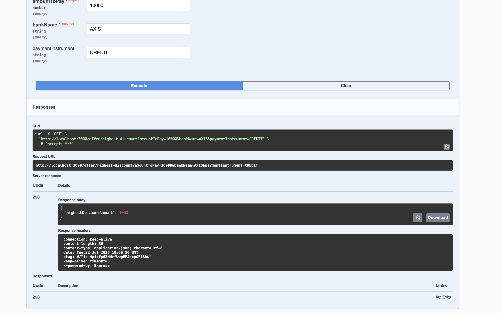

# PiePay Backend

**[→ Submission Answers (ANSWER.md)](ANSWER.md)**  
**[→ Flipkart Offer API Explanation (FLIPKART_OFFER_API.md)](FLIPKART_OFFER_API.md)**

## Visual Overview

Below are some reference images to help you understand the API flow and database structure:

- **Database Schema**
  
  
  
- **POST /offer Request Example**
  
  
  
- **POST /offer Response Example**
  
  
  
- **GET /offer/highest-discount Example**
  
  

---

## Setup Instructions

1. **Clone the repository**
2. **Install dependencies**
   ```bash
   cd backend
   npm install
   ```
3. **Configure your database**
   - Set your PostgreSQL connection string in `.env` as `DATABASE_URL=...`
4. **Run migrations**
   ```bash
   npx prisma migrate dev --name init-offer
   ```
5. **Seed the database with dummy offers**
   ```bash
   npm run prisma:seed
   ```
6. **Start the server**
   ```bash
   npm run start
   ```
7. **Test the API in Swagger UI**
   - Open [http://localhost:3000/api](http://localhost:3000/api)

## Docker & Docker Compose

### Build and Run (Production)
```bash
docker-compose up --build
```
- The backend will run in production mode (compiled app).
- Swagger UI: [http://localhost:3000/api](http://localhost:3000/api)

### Run in Development Mode
```bash
MODE=dev docker-compose up --build
```
- The backend will run in dev mode (hot reload, watches for changes).

### Stopping and Cleaning Up
```bash
docker-compose down -v
```
- This stops all containers and removes the database volume.

## Seed Data
- The seed script inserts 10 dummy offers for various banks and payment instruments.
- You can use these for testing the `/offer/highest-discount` endpoint.

## Example GET /offer/highest-discount
```
GET /offer/highest-discount?amountToPay=10000&bankName=AXIS&paymentInstrument=CREDIT
```

## Notes
- If you want to add more offers, edit `prisma/seed.ts` and re-run the seed script.
- For more details on the Flipkart offer API, see `FLIPKART_OFFER_API.md`. 